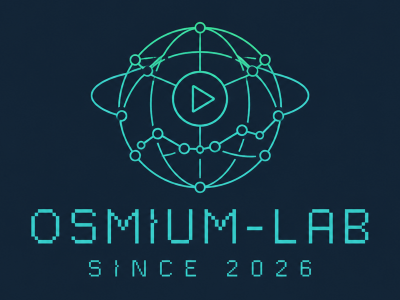

# Osmium Lab

<p align="center">
  
</p>

<p align="center">
  台灣市場歷史行情回播與策略回測平台
</p>

<p align="center">
  
  
  
  
  
</p>

Osmium Lab 是一套以 Rust 建立、使用 Teralion 歷史行情的 market replay 與 backtesting
平台。它把資料同步、完整性驗證、格式正規化、deterministic replay、策略執行、成交模擬與
帳務整合成一條可重現的工作流程。

平台以 `match_time` 作為唯一回播時間。下載完成的 verified source 可以跨次回測重用，
replay cache 則是可刪除、可離線重建的衍生資料。策略只會讀到當下與過去已發生的事件，
不會在回測途中偷偷下載資料或取得未來資訊。

目前 repository 已經具備：

- TWSE、TPEx 與 TAIFEX 歷史行情同步、驗證及本地保存。
- TWSE／TPEx 股票與權證、TAIFEX 期貨與選擇權的 wire-format normalization。
- 多交易日、多商品的 deterministic streaming replay 與 checksum。
- 編譯期註冊的 Rust strategy、market／limit order、partial fill、slippage、fee、tax 與帳務。
- 回測 artifacts、結果檢查、JSON output、穩定 exit category 與可重現 release archive。
- 只讀的歷史行情 TUI，可同步檢視折線、成交量、完整五檔與最近成交。

## 專案重點

- **Offline first**：只有 `data sync` 需要網路與 Teralion credential；資料準備完成後，
  verify、cache build、replay、backtest 與 inspect 都可離線執行。
- **Deterministic by design**：事件先依 `match_time` 排序，相同時間再使用版本化 tie-break；
  相同資料、設定與版本會產生相同事件、狀態與結果 checksum。
- **資料證據可追溯**：source manifest、cache lineage、execution plan、策略參數、fill model
  與 accounting version 都會進入驗證或 run artifacts。
- **符合資料精度**：五檔是完整 snapshot replacement，不反推逐筆委託、真實排隊順位或
  隱藏流動性。
- **只讀所需商品**：strategy 使用 explicit universe，replayer 只開啟 execution plan
  需要的 partitions 與 streams。

## 目前狀態

`0.1.0` 已完成公開 release 所需的主要資料與回測流程：

- `plan -> data sync -> data verify -> cache prepare -> replay/backtest -> inspect`
- 一份 `config_version: 2` YAML 定義 universe、strategy、simulation、economics 與 output。
- verified source 採 immutable revision；不完整或損壞資料預設拒絕進入正式回測。
- replay cache 綁定 source checksum、event schema 與 cache format，可由本地 source 重建。
- MarketState 原子套用完整五檔、成交、累計量、flags 與 `match_time`。
- strategy 讀取更新後的唯讀 MarketState，並接收 order／fill feedback。
- execution simulation 支援後續事件模型及 opt-in scheduled visible-depth 模型。
- run result 保存 orders、fills、positions、已實現／未實現損益、版本與 checksum。

### 支援市場

| 市場 | 商品 | 行情能力 |
| --- | --- | --- |
| TWSE | 股票、權證 | 成交、完整五檔、累計量與來源 flags |
| TPEx | 股票、權證 | 成交、完整五檔、累計量與來源 flags |
| TAIFEX | 期貨、選擇權 | 成交批次、完整五檔與跨日 trading date |

處置證券會沿一般商品路徑回播來源實際提供的狀態，但平台不重新模擬處置撮合規則。

### 明確邊界

Osmium Lab 是歷史行情回播與回測工具，不是即時交易系統或完整交易所撮合引擎。目前不支援：

- 即時交易、盤中／盤後零股、盤後定價與鉅額交易。
- 逐筆委託簿重建、精確 queue position 或 hidden liquidity 推論。
- 瞬間價格穩定措施與處置撮合規則的重算。
- 從低粒度資料產生來源不存在的高粒度市場資訊。
- runtime strategy plugin；策略必須編譯並註冊進 `osmium` binary。

## 系統流程

```text
RunConfig
   │
   v
Execution Plan
   │
   ├──> Teralion sync ──> Verified Local Source
   │                              │
   │                              v
   │                       Rebuildable Replay Cache
   │                              │
   v                              v
Selective Event Streams ──> Replay Engine ──> MarketState
                                                │
                                                v
                                            Strategy
                                                │
                                                v
                                  Fill Simulation + Accounting
                                                │
                                                v
                                           Run Artifacts
```

核心邊界：Teralion wire types 只存在於 adapter／normalizer；replay、MarketState、strategy
與 simulation 只使用 versioned domain events。

## Workspace 結構

```text
.
├── crates/
│   ├── market-types/       # 市場型別與 versioned domain events
│   ├── market-state/       # snapshot-based state 與 reducer
│   ├── normalizer/         # TWSE／TPEx／TAIFEX normalizers
│   ├── data-sync/          # Teralion sync、source repository 與 cache
│   ├── run-planner/        # config 驗證、session 與 execution plan
│   ├── replay-engine/      # deterministic ordering 與 streaming replay
│   ├── strategy-api/       # Strategy trait、registry 與 order intent
│   ├── example-strategy/   # 可編譯註冊的範例策略
│   ├── execution-sim/      # fill、費稅、部位與損益
│   ├── osmium-config/      # release RunConfig boundary
│   ├── osmium-runner/      # 工作流程協調與 run artifacts
│   └── osmium-cli/         # `osmium` binary 與歷史行情 TUI
├── docs/                   # 需求、架構、介面、操作與 release 文件
├── examples/               # release 與 synthetic smoke configs
├── fixtures/               # repository-owned synthetic fixtures
└── tools/                  # acceptance 與 release tooling
```

## 快速開始

### 1. 準備環境

需要 Rust `1.97.1`；repository 的 `rust-toolchain.toml` 會自動選擇正確 toolchain，並包含
`rustfmt` 與 `clippy`。

```sh
rustc --version
cargo --version
cargo build --release -p osmium-cli
target/release/osmium version
```

也可以在後續指令中以 `cargo run --release -p osmium-cli --` 取代
`target/release/osmium`。

### 2. 建立設定

複製 release example，並修改自己的 `data_root`、日期、商品、strategy 與 economics：

```sh
cp examples/config.yaml my-config.yaml
target/release/osmium config check --config my-config.yaml
target/release/osmium plan --config my-config.yaml
```

`config_version: 2` 是必要欄位。價格、費率、slippage、multiplier 與金額等 exact numeric
values 以 YAML string 表達；設定檔不能包含 API key、cookie、bearer token 或 signed URL。

### 3. 同步並準備資料

第一次下載資料時，在 process environment 或 repository root 的 `.env` 提供
`TERALION_API_KEY`：

```sh
cp .env.example .env
# 編輯 .env，填入自己的 TERALION_API_KEY

target/release/osmium data sync --config my-config.yaml
target/release/osmium data verify --config my-config.yaml
target/release/osmium cache prepare --config my-config.yaml
```

只有 `data sync` 會讀取 credential 或建立 HTTP client。已完成的 source 不會被靜默覆寫；
cache 刪除或版本失效時，可以從 verified source 離線重建，不需要重新下載。

### 4. 離線回播與回測

```sh
target/release/osmium replay --config my-config.yaml
target/release/osmium backtest \
  --config my-config.yaml \
  --output runs/my-first-run
target/release/osmium inspect --run runs/my-first-run
```

`replay` 驗證事件順序、MarketState 與 checksum；`backtest` 才會執行 strategy、orders、
fills 與 accounting。`--output` 必須指定尚不存在的新目錄。

若想一次完成 plan、資料準備與回測：

```sh
target/release/osmium run \
  --config my-config.yaml \
  --output runs/my-first-run
```

`run` 會依 plan 自動呼叫 `data sync`；source 缺少或需要重新取得時會使用網路與
`TERALION_API_KEY`。

所有 non-interactive commands 都支援 `--format human|json`、`--quiet` 與 `--no-color`。
自動化流程應使用 `--format json`，不要解析 human-readable output。

## 歷史行情 TUI

先完成 `data verify` 與 `cache prepare`，再啟動只讀介面：

```sh
target/release/osmium display --config my-config.yaml
```

| 按鍵 | 動作 |
| --- | --- |
| `←`／`→` | 切換標的，不改變播放時間 |
| `Space` | 暫停／繼續 |
| `+`／`-` | 切換固定播放速度 |
| `R` | 重設為 `1.0x` |
| `Q` | 離開 |

畫面會呈現目前標的、`match_time`、播放狀態、價格折線、一分鐘 observed volume、完整五檔
與最新成交明細。

## Strategy 開發

release CLI 只執行已編譯進 binary 且加入 `StrategyRegistry` 的 Rust strategy。新增策略時：

1. 實作 `strategy-api` 的 `Strategy` 與 `StrategyFactory`。
2. 宣告固定的 strategy id、version、參數 schema、universe 與 sessions。
3. 在 `osmium-cli` 的 compiled registry 註冊 factory。
4. 重新編譯 `osmium`，再由 YAML 的 `strategy.id + version` 選取。

可從 [`example-strategy`](crates/example-strategy/src/lib.rs) 的
`example.price-threshold-buy-once` 開始。策略 callback 只能使用目前 event、更新後的唯讀
MarketState、TradingContext、自身狀態與已發生的 feedback；不得讀取 next event、wall clock、
network 或未記錄 randomness。

完整說明見 [使用指南](docs/user-guide.md) 與
[回播模型](docs/architecture/replay-model.md)。

## 驗證指令

一般變更至少執行：

```sh
cargo fmt --all --check
cargo test --workspace
```

完整 release gate：

```sh
python3 tools/acceptance/generate_synthetic_fixtures.py
git diff --exit-code -- fixtures
tools/acceptance/verify_compact_fixtures.sh
cargo fmt --all --check
cargo clippy --workspace --all-targets -- -D warnings
cargo test --workspace
RUSTDOCFLAGS="-D warnings" cargo doc --workspace --no-deps
```

repository 只保存自行建立的 synthetic fixtures，不包含、抽樣或轉換任何真實行情。
完整交易日驗收使用 repository 外、經授權的 user-owned data root。

## 建立 release archive

```sh
tools/release/package.sh --output target/osmium-release.tar.gz
tools/release/smoke_clean_machine.sh \
  --archive target/osmium-release.tar.gz \
  --checksum target/osmium-release.tar.gz.sha256
SOURCE_DATE_EPOCH=0 tools/release/verify_reproducibility.sh \
  --output target/release-repro
```

archive 不包含 raw data、`target/`、`.env` 或 acceptance payload，並附帶 SHA-256、
CycloneDX SBOM、third-party license inventory 與離線 installer。

## 文件

- [文件總覽](docs/README.md)
- [產品需求](docs/product-requirements.md)
- [快速開始](docs/quickstart.md)
- [使用指南](docs/user-guide.md)
- [CLI 參考](docs/operations/cli.md)
- [RunConfig 設定參考](docs/config-reference.md)
- [架構總覽](docs/architecture/overview.md)
- [資料流程與儲存](docs/architecture/data-flow.md)
- [回播模型](docs/architecture/replay-model.md)
- [模擬與帳務](docs/architecture/execution-model.md)
- [本地資料](docs/operations/local-data.md)
- [驗證](docs/operations/validation.md)
- [發布](docs/operations/release.md)
- [支援政策](docs/operations/support.md)

中文 API 文件可由 rustdoc 產生：

```sh
cargo doc --workspace --no-deps --open
```

## 設計原則

- verified local source 是可重用的事實資料；replay cache 是可重建 artifact。
- Teralion wire format 與 domain events 保持分離。
- `match_time` 是唯一 replay time，相同時間使用 deterministic tie-break。
- MarketState 只根據成交與完整五檔 snapshot，不重建 queue position。
- strategy 讀取市場狀態，但不能修改市場狀態、回播時鐘或歷史事件。
- replayer 只開啟 strategy universe 所需的 streams。
- 不完整、未知或來源無法證明的語意保持未知，不自行猜測。

## 授權

本專案採用 [MIT License](LICENSE)。
